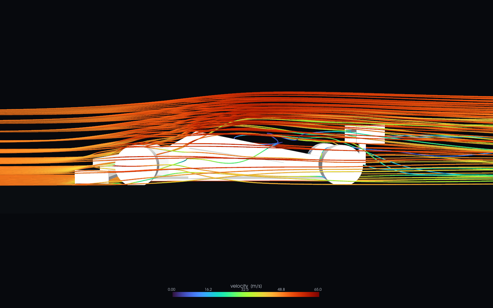

# F1Apex

CFD of bluff bodies and an F1-like car — OpenFOAM RANS solved locally, then
turned into an interactive flow viewer that runs anywhere.

**→ [jaesun57.github.io/F1Apex](https://jaesun57.github.io/F1Apex/)**

Drag to orbit the 3D streamlines, or switch to the 2D mid-plane view where
particles are advected through the solved velocity field. No install, no Docker,
no server — the page is fully self-contained.



---

## What this is

```
parametric geometry (build123d)  →  STL
   → OpenFOAM case  (blockMesh · snappyHexMesh · potentialFoam · simpleFoam)
   → forces, mid-plane field, 3D streamlines
   → static viewer
```

Everything is parametric and solved from scratch: no downloaded meshes, no
canned results. Change a dimension, re-run, see what it did.

## Results so far

| | Rectangular block | Parametric car |
|---|---|---|
| Cells | 375,803 | 1,107,311 |
| Freestream | 30 m/s | 50 m/s |
| Wall clock | 139 s (300 iter) | 834 s end-to-end |
| C_d | 0.899 | 0.696 |
| C_l | −0.173 (downforce) | +0.362 (**lift**) |

The car makes **lift, not downforce** — which is correct for the geometry as
built. Its wings are currently flat plates at zero incidence, so they generate
essentially nothing, while the tapered body acts as a lifting shape. The
inverted-aerofoil machinery exists in `geometry/airfoils.py`; wiring it into the
car is the next step.

## Convergence, and why it is not a boolean

Residuals are not used as the criterion. Steady external aerodynamics with
separation plateaus around 1e-3–1e-4 and never reaches 1e-6, so a residual
threshold either never fires or fires on a solution that is still moving.

Instead the forces themselves are watched over a 200-iteration window, splitting
two questions that are usually collapsed into one:

- **drift** — is the *mean* still moving between windows?
- **scatter** — does the instantaneous value swing about that mean?

For the block, run to 700 iterations:

| | drift | scatter | |
|---|---|---|---|
| C_d | 0.001% | 0.128% | converged |
| C_l | 0.005% | **3.348%** | mean fixed, oscillating |

The mean stopped moving while instantaneous C_l keeps swinging between −0.165
and −0.182. The solver has settled into a **limit cycle** rather than a fixed
point: a sharp-edged bluff body genuinely wants to shed vortices, and steady RANS
assumes a time-independent solution that does not exist here.

So the mean is usable, the instantaneous value is not, and the oscillation itself
is the finding — it says the wake is unsteady and wants a transient solver
(`pimpleFoam` with URANS or DES).

## Honest limits

- **Not validated.** No comparison against experiment or published data, and no
  grid-convergence (GCI) study. The coefficients are the right order of
  magnitude, not numbers to quote.
- **Coarse meshes with wall functions** (y⁺ 30–100), so boundary layers are
  modelled rather than resolved.
- **Steady RANS**, so unsteady shedding is averaged away — see above.
- **The animation rides a frozen field.** Particles follow a converged, fixed
  velocity field: these are streamlines, not pathlines.

## Running it

Requires Docker (native arm64 OpenFOAM image) and Python 3.11+.

```bash
python3 -m venv .venv && ./.venv/bin/python -m pip install -e ".[dev]"
```

```bash
./.venv/bin/python -m pytest tests/ -q
```

Solve and visualise a case:

```bash
./.venv/bin/python -c "
from pathlib import Path
from f1apex.geometry.primitives import BoxBody
from f1apex.case.tunnel import TunnelParams, write_case
from f1apex.case.runner import run_pipeline
body = BoxBody(); case = Path('runs/mybox'); case.mkdir(parents=True, exist_ok=True)
write_case(case, body.export(case/'_body.stl'), body.bounds, TunnelParams())
print(run_pipeline(case)['stages'])
"
```

Benchmark the container, and serve the viewer:

```bash
./scripts/calibrate.sh 6 200
```

```bash
cd docs && python3 -m http.server 8777
```

Opening `docs/index.html` as a `file://` URL will not work — `fetch` is blocked.

## Layout

```
src/f1apex/
  config.py              constants, cell-budget and y+ arithmetic
  geometry/              BoxBody, parametric car, multi-element wing
  case/                  tunnel.py writes a case from any STL; runner.py runs it
  post/                  forces, convergence, field slice, 3D tracks, rendering
docs/                    GitHub Pages root — self-contained, no build step
runs/                    gitignored, ~1.5 GB, regenerable from code
tests/                   22 tests, aimed at silent-failure modes
```

Development notes, including the container gotchas that all fail silently, are
in [CLAUDE.md](CLAUDE.md).

## License

MIT
